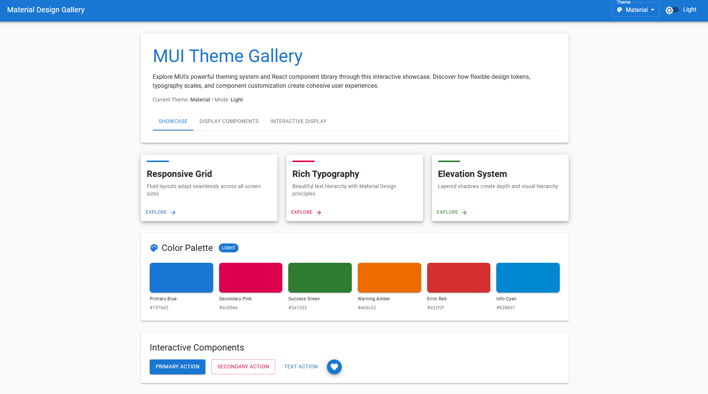

# material-design

A beautiful Single Page Application (SPA) showcasing Google's Material Design principles, built with React, Vite, and Material-UI (MUI). Features an interactive electronic parts catalog with drag-and-drop functionality.


## 🌐 Live Demo

**[View Live Application](https://material-design-ten.vercel.app/)**

The application is deployed on Vercel and showcases all Material Design features including interactive components, drag-and-drop catalog, and circuit board explorer.

## 📸 Screenshot


_Main application interface showcasing Material Design components and dark/light theme toggle_

## 🎬 Demo


_Interactive demonstration of drag-and-drop and reorder feature_

## Features

- 🎨 **Material Design Components** - Comprehensive showcase of MUI components
- 🌓 **Dark/Light Theme Toggle** - Switch between themes seamlessly
- 📱 **Responsive Design** - Fully responsive layout using CSS Grid
- ⚡ **Fast Development** - Powered by Vite for instant HMR
- 🎭 **Interactive UI** - Buttons, cards, FABs, and more
- 🎨 **Color Palette** - Display of Material Design color system
- 📦 **Electronic Parts Catalog** - Interactive product catalog with detailed specifications
- 🔄 **Drag & Drop** - Reorder catalog items in both list and grid views
- 📋 **Dual Display Modes** - Switch between List and Grid views with navigation tabs
- 💬 **Modal Details** - Click-to-view detailed product information
- 🏷️ **Order Management** - Automatic order number updates during reordering
- 🔌 **Interactive Circuit Board Explorer** - Visual circuit board with clickable components
- 🎯 **Component Highlighting** - Select components to highlight on circuit board with golden glow
- 📊 **Multi-Board Selection** - Choose between different circuit board designs

## Tech Stack

- **React 19** - Latest React with modern features
- **Vite 7** - Next generation frontend tooling
- **Material-UI v7** - Comprehensive React component library
- **Emotion** - CSS-in-JS styling solution
- **@hello-pangea/dnd** - Beautiful drag and drop for lists

## 🚀 Deployment

The application is deployed on **Vercel** with automatic deployments from the main branch.

- **Live URL:** https://material-design-ten.vercel.app/
- **Platform:** Vercel
- **Auto-deploy:** ✅ Connected to GitHub repository

## Getting Started

### Prerequisites

- Node.js (v16 or higher)
- npm or yarn

### Installation

1. Clone the repository:

```bash
git clone https://github.com/Serk4/material-design.git
cd material-design
```

2. Install dependencies:

```bash
npm install
```

### Development

Start the development server:

```bash
npm run dev
```

The application will open at `http://localhost:3000`

### Build

Create a production build:

```bash
npm run build
```

### Preview Production Build

Preview the production build locally:

```bash
npm run preview
```

## Project Structure

```
material-design/
├── src/
│   ├── components/
│   │   ├── FeatureShowcaseCard.jsx    # Feature card component
│   │   ├── ColorPaletteDisplay.jsx    # Color palette component
│   │   ├── ListDisplay.jsx            # Electronic parts list view with drag-drop
│   │   ├── GridDisplay.jsx            # Electronic parts grid view with drag-drop
│   │   └── CircuitBoardDisplay.jsx    # Interactive circuit board explorer
│   ├── data/
│   │   ├── productsData.json          # Electronic parts catalog data
│   │   └── circuitBoardsData.json     # Circuit board and component data
│   ├── MaterialShowcase.jsx           # Main app component with navigation
│   └── main.jsx                       # Application entry point
├── index.html                         # HTML template
├── vite.config.js                     # Vite configuration
└── package.json                       # Project dependencies
```

## Components

### MaterialShowcase

The main application component featuring:

- AppBar with theme toggle
- Welcome section with navigation tabs
- Showcase mode: Feature cards grid, color palette, interactive components
- Display Components mode: Electronic parts catalog with list/grid toggle
- Interactive Display mode: Circuit board explorer with component highlighting

### Electronic Parts Catalog

**ListDisplay & GridDisplay Components:**

- Display electronic parts with order numbers and names
- Drag-and-drop reordering functionality
- Click-to-view detailed product modals
- Responsive grid layout (1-4 columns based on screen size)
- Compatible widgets and specifications display

**Data Structure:**

- 10 electronic parts including Arduino, Raspberry Pi, sensors, motors
- Order numbers, descriptions, pricing, stock levels
- Technical specifications and compatible widgets arrays
- JSON-based data structure mimicking database fetch

### Interactive Circuit Board Explorer

**CircuitBoardDisplay Component:**

- Visual SVG-based circuit board with realistic green PCB design
- Clickable electronic components with highlighting effects
- Component selection from sidebar list with type-specific icons
- Real-time component details display with specifications
- Multi-board selection between different circuit designs

**Circuit Board Features:**

- **LED Controller Board** - 7 components including resistors, LEDs, buttons, capacitors, and timer IC
- **Sensor Interface Board** - 9 components including op-amps, sensors, transistors, and connectors
- **Golden highlighting** effect when components are selected
- **Component positioning** with X,Y coordinate tracking
- **Type-based color coding** for different component categories

### FeatureShowcaseCard

Reusable card component with hover effects and action buttons.

### ColorPaletteDisplay

Visual display of Material Design color palette with all theme colors.

## Usage

### Navigation

- **Showcase Tab**: View the original Material Design component demonstrations
- **Display Components Tab**: Access the electronic parts catalog
- **Interactive Display Tab**: Explore interactive circuit boards with component highlighting
- Switch between List and Grid views using the toggle buttons

### Drag & Drop

- Drag items by their drag handle (≡ icon) to reorder
- Order numbers automatically update after reordering
- Works in both List and Grid display modes

### Product Details

- Click any product item to view detailed specifications
- Modal dialogs show pricing, stock, technical specs, and compatible widgets
- Responsive layout adapts to screen size

### Interactive Circuit Board

- Select circuit board from dropdown menu (LED Controller or Sensor Interface)
- Click components on the circuit board or in the component list to highlight
- View detailed component information in the right panel
- Components display with realistic colors and positioning on green PCB
- Golden glow effect indicates selected components

## License

ISC
